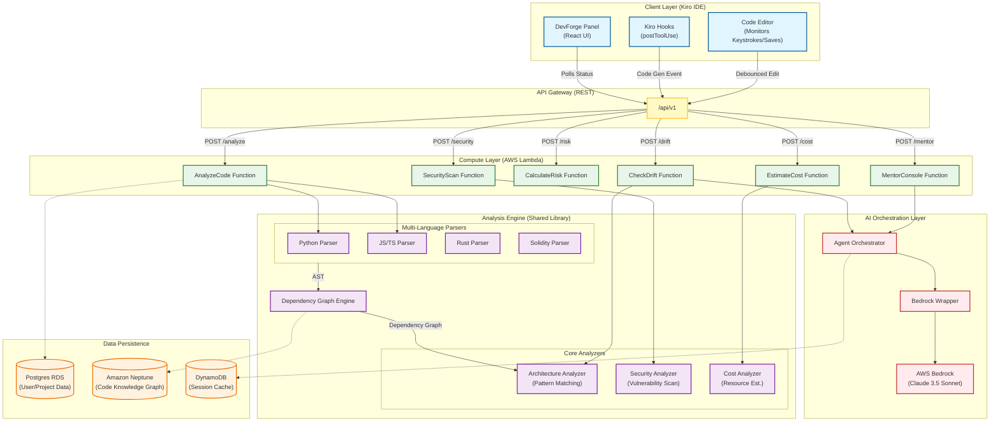

# DevForge: Intelligent Architecture Validation Extension for Kiro

DevForge is a powerful extension for the Kiro IDE that enforces architectural discipline, provides real-time mentorship, and validates system design decisions. It integrates seamlessly into the development workflow to offer immediate feedback on code structure, performance implications, and security risks.

## Background

In the fast-paced world of modern software development, architectural integrity often takes a backseat to speed. Developers, especially those in the early stages of their careers, frequently struggle to bridge the gap between writing functional code and building scalable, secure, and cost-effective systems. This disconnect leads to "silent technical debt"—problems that are not visible until they cause a system failure or a massive cloud bill. Furthermore, the traditional learning path for students is often siloed: they learn syntax in one place and system design in another, rarely seeing how they intersect in real-world scenarios.

## Problem Addressing

DevForge addresses these critical gaps by shifting architectural validation and mentorship to the earliest possible point: the IDE itself.

*   **Combating Silent Technical Debt**: By detecting architectural drift and design violations *as code is written*, DevForge prevents costly refactoring later.
*   **Bridging the "Tutorial Hell" Gap**: Students often get stuck copying code without understanding the "why." DevForge's real-time mentorship provides context, explaining concepts like time complexity and design patterns in situ.
*   **Solving Cost Blindness**: Cloud costs are usually a post-deployment surprise. DevForge brings cost awareness to the editor, showing the financial impact of code choices (e.g., "This polling loop will cost $50/month in Lambda invocations").
*   **Shifting Security Left**: Instead of waiting for a security audit, DevForge flags vulnerabilities like hardcoded secrets or unsafe dependencies immediately, making security a proactive habit.

## System Architecture

The following diagram illustrates the detailed architecture of DevForge, showcasing the flow from the Kiro IDE through the API Gateway, Lambda functions, Analysis Engine, and Data Persistence layers.

## Features

DevForge offers a comprehensive suite of features categorized into **Core Modules**, **Developer Mode**, **Student Mode**, and **Advanced Capabilities**.

### Core Modules

1.  **Architecture Constraint Definition**: Define project-specific constraints (e.g., "Must use gRPC," "Maximum latency 200ms") via a simple configuration UI.
2.  **Blueprint Generator**: Automatically generate visual architecture blueprints from code or text descriptions.
3.  **Real-time Risk Dashboard**: Visualizes risk across four critical dimensions:
    *   **Scalability**: Is the system designed to scale?
    *   **Over-engineering**: Is the solution too complex for the problem?
    *   **Security**: Are there obvious vulnerabilities?
    *   **Consistency**: Does the code match the agreed-upon design?
4.  **Critical Gates**: Blocking modals that interrupt deployment for severe issues:
    *   **Security Gate**: Triggered by hardcoded secrets or unencrypted data.
    *   **Cost Gate**: Triggered by projected cost spikes > 50%.
    *   **Deployment Risk Gate**: Triggered by critical drift or high risk scores.

### Developer Mode Features

Designed for professional engineering teams.

5.  **Architecture Drift Detector**: Continuously monitors code against the blueprint, detecting unauthorized deviations immediately.
6.  **Scale Collapse Predictor**: Simulates load to predict system breaking points (e.g., "Database connection pool exhaustion at 50k users").
7.  **Cost Whisperer**: Provides real-time AWS cost estimates based on resource allocation patterns in the code.
8.  **Smart Contract Vulnerability Scanner**: Specialized analysis for blockchain development (e.g., reentrancy attacks).
9.  **On-Chain vs. Off-Chain Optimizer**: Suggests optimal data placement strategies for Web3 applications.
10. **ML Pipeline Validator**: Validates machine learning workflows for data leakage and pipeline integrity.
11. **Chaos Monkey Agent**: Proactively tests system resilience by simulating component failures.

### Student Mode Features

Focuses on learning, mentorship, and algorithmic mastery.

12. **Algorithmic Pattern Recognition**: Identifies suboptimal code patterns (e.g., O(n²) loops) and suggests improvements.
13. **Real-time Mentorship Console**: An AI-driven mentor that explains concepts and provides actionable feedback.
14. **Kiro Comprehension Validator**: Interactive quizzes to ensure understanding of the code just written.
15. **LeetCode Pattern Mapper**: Automatically links code issues to relevant practice problems (detailed below).
16. **Argue With Me Mode**: An adversarial AI mode that challenges the user to defend their implementation choices.
17. **Anti-Vibe Critic**: A strict code reviewer that flags "code smells" and non-idiomatic usage.

